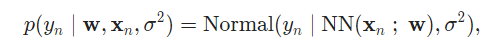

# 贝叶斯神经网络
贝叶斯网络是一种在权重上有先验分布的神经网络。（Neal,2012） 

例如一个数据集{（Xn,Yn）},每个数据点包含特征Xn∈R^D 和输出Yn∈R,定义每个数据点的似然函数如下：


NN是一个神经网络，它的权重和偏差组成隐变量。假设σ^2是已知变量
在权重和偏差上定义先验分布为标准正态分布


让我们用Edward建里模型。定义一个含tanh函数的3层贝叶斯神经网络。

```Python
from edward.models import Normal

def neural_network(x):
    h = tf.tanh(tf.matmul(x, W_0) + b_0)
    h = tf.tanh(tf.matmul(h, W_1) + b_1)
    h = tf.matmul(h, W_2) + b_2
    return tf.reshape(h, [-1])

N = 40  # number of data ponts
D = 1   # number of features

W_0 = Normal(loc=tf.zeros([D, 10]), scale=tf.ones([D, 10]))
W_1 = Normal(loc=tf.zeros([10, 10]), scale=tf.ones([10, 10]))
W_2 = Normal(loc=tf.zeros([10, 1]), scale=tf.ones([10, 1]))
b_0 = Normal(loc=tf.zeros(10), scale=tf.ones(10))
b_1 = Normal(loc=tf.zeros(10), scale=tf.ones(10))
b_2 = Normal(loc=tf.zeros(1), scale=tf.ones(1))

x = tf.cast(x_train, dtype=tf.float32)
y = Normal(loc=neural_network(x), scale=0.1 * tf.ones(N))
```

这个程序使用的x_train已经存在python环境中，或者，你也可以定义tensorflow中的placeholder函数

这个placeholder函数在推断时候，给它的参数赋值。
```Python
x = tf.placeholder(tf.float32, [N, D])
```

在入门章节可以看到示范，源码在github网站的仓库路径下： examples/bayesian_nn.py

引用：
Neal, R. M. (2012). Bayesian learning for neural networks (Vol. 118). Springer Science & Business Media.
